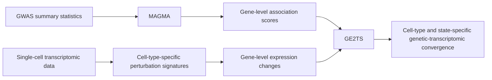

# GE2TS — Genetic Effects-to-Transcriptomic Scores

**Integrating gene-level genetic association with single-cell transcriptional responses**

GE2TS (Genetic Effects-to-Transcriptomic Scores) is a computational framework for integrating gene-level genetic association with transcriptional responses measured in single-cell data.

GE2TS combines **MAGMA-derived gene-level association scores from GWAS** with **gene-level transcriptional perturbation profiles** to test whether genes carrying stronger inherited association signals are preferentially represented within the transcriptional response of specific cell types or biological states.

GE2TS provides a measure of **genetic–transcriptomic convergence**. It does not, by itself, establish causal genes or infer the direction of the genetic effect on gene expression.

## Rationale

GWAS and gene-level association analyses identify genes linked to inherited disease risk but provide limited information about the cellular contexts in which these associations may become biologically relevant.

Conversely, single-cell perturbation experiments identify transcriptional responses with cell-type resolution but do not indicate which responses preferentially involve genes carrying inherited genetic association.

GE2TS connects these two levels by testing whether the strength of gene-level genetic association is systematically related to transcriptional responses observed in defined cell populations and biological conditions.

## Overview of the GE2TS workflow

## Inputs

GE2TS integrates gene-level genetic association with biologically defined gene sets or transcriptomic signatures.

### 1. Genetic association

Gene-level association statistics are generated from GWAS summary statistics using MAGMA.

The pipeline can start from:

- raw GWAS summary statistics;
- a pre-processed GWAS input file; or
- pre-computed MAGMA `.genes.out` results.

MAGMA gene-level results include gene identifiers, gene-level Z-scores, and association P-values.

### 2. Transcriptomic or biological gene signatures

Gene sets are supplied in GMT format.

These gene sets can represent pathways, cell-type-specific transcriptional programs, or gene signatures derived from single-cell perturbation analyses.

Each signature defines the set of genes against which MAGMA gene-level association scores are evaluated.

## GE2TS analysis

For each transcriptomic or biological gene signature, GE2TS identifies the genes shared with the MAGMA gene-level results and summarizes the strength of genetic association within that gene set.

For each signature, the current implementation reports:

- number of genes in the signature;
- number of genes matched to MAGMA results;
- mean MAGMA gene Z-score;
- median MAGMA gene Z-score;
- maximum MAGMA gene Z-score;
- highest-scoring gene; and
- a gene-set summary statistic and associated P-value.

This allows transcriptomic programs or cell-type-specific gene signatures to be ranked according to the extent to which they contain genes carrying stronger inherited genetic association.

## Analysis workflow

The analysis consists of four main steps:

1. **Prepare genetic scores**  
   MAGMA gene-level results are imported and standardized.

2. **Prepare transcriptional signatures**  
   Cell-type-specific differential-expression results are formatted as gene-level transcriptional response profiles.

3. **Integrate genetic and transcriptomic data**  
   Gene identifiers are harmonized and genetic association scores are matched to transcriptional response statistics.

4. **Quantify and visualize GE2TS relationships**  
   Genetic–transcriptomic relationships are calculated across cell types and conditions and summarized using correlation plots, heatmaps, and gene-level visualizations.

## Interpretation

GE2TS is intended as a complementary analysis to conventional GWAS locus mapping and gene prioritization.

Rather than asking only whether a gene is genetically associated with disease, GE2TS asks whether genetically associated genes collectively converge on transcriptional responses occurring in particular cell types or biological states.

The analysis therefore provides a way to connect inherited genetic association with cell-type-specific functional responses.

GE2TS should not be interpreted as evidence that:

- an individual gene is causal;
- genetic variation directly causes the observed expression change;
- the sign of a GE2TS relationship represents the direction of genetic risk

