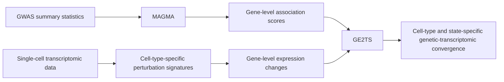

# GE2TS — Genetic Effects-to-Transcriptomic Scores

**Integrating gene-level genetic association with single-cell transcriptional responses**

GE2TS (Genetic Effects-to-Transcriptomic Scores) is a computational framework for integrating gene-level genetic association with transcriptional responses measured in single-cell data.

GE2TS combines **MAGMA-derived gene-level association scores from GWAS** with **gene-level transcriptional perturbation profiles** to test whether genes carrying stronger inherited association signals are preferentially represented within the transcriptional response of specific cell types or biological states.

GE2TS provides a measure of **genetic–transcriptomic convergence**. It does not, by itself, establish causal genes or infer the direction of the genetic effect on gene expression.

## Rationale

GWAS and gene-level association analyses identify genes linked to inherited disease risk but provide limited information about the cellular contexts in which these associations may become biologically relevant.

Conversely, single-cell perturbation experiments identify transcriptional responses with cell-type resolution but do not indicate which responses preferentially involve genes carrying inherited genetic association.

GE2TS connects these two levels by testing whether the strength of gene-level genetic association is systematically related to transcriptional responses observed in defined cell populations and biological conditions.

## Overview of the GE2TS workflow

## Inputs

### 1. Genetic association

Gene-level association statistics generated from GWAS summary statistics using MAGMA.

Typical variables include:

- gene identifier
- MAGMA gene-level Z-score
- MAGMA P-value

### 2. Transcriptional response

Gene-level differential-expression statistics derived from single-cell transcriptomic analyses performed separately for defined cell types and experimental or biological conditions.

Typical variables include:

- gene identifier
- cell type
- perturbation or condition
- log-fold change or equivalent expression statistic
- differential-expression P-value

## GE2TS analysis

For each cell type and transcriptional condition, genes present in both datasets are matched and the relationship between gene-level genetic association and transcriptional response is quantified.

Conceptually, GE2TS evaluates:

**MAGMA gene-level association score ↔ transcriptional response**

across genes within each cellular context.

A positive relationship indicates that genes with stronger genetic association tend to occur toward the upregulated end of the transcriptional response.

A negative relationship indicates that genes with stronger genetic association tend to occur toward the downregulated end of the transcriptional response.

Importantly, the sign of this relationship describes the **direction of the transcriptional response**. MAGMA gene Z-scores quantify the strength of gene-level association and do not provide the direction of the underlying genetic effect.

## Analysis workflow

The analysis consists of four main steps:

1. **Prepare genetic scores**  
   MAGMA gene-level results are imported and standardized.

2. **Prepare transcriptional signatures**  
   Cell-type-specific differential-expression results are formatted as gene-level transcriptional response profiles.

3. **Integrate genetic and transcriptomic data**  
   Gene identifiers are harmonized and genetic association scores are matched to transcriptional response statistics.

4. **Quantify and visualize GE2TS relationships**  
   Genetic–transcriptomic relationships are calculated across cell types and conditions and summarized using correlation plots, heatmaps, and gene-level visualizations.

## Interpretation

GE2TS is intended as a complementary analysis to conventional GWAS locus mapping and gene prioritization.

Rather than asking only whether a gene is genetically associated with disease, GE2TS asks whether genetically associated genes collectively converge on transcriptional responses occurring in particular cell types or biological states.

The analysis therefore provides a way to connect inherited genetic association with cell-type-specific functional responses.

GE2TS should not be interpreted as evidence that:

- an individual gene is causal;
- genetic variation directly causes the observed expression change;
- the sign of a GE2TS relationship represents the direction of genetic risk

